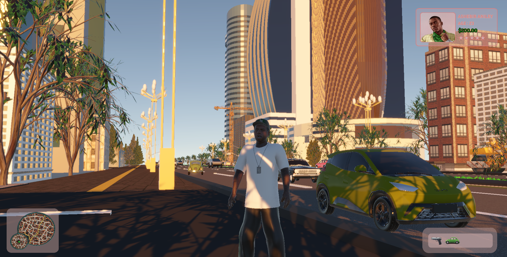
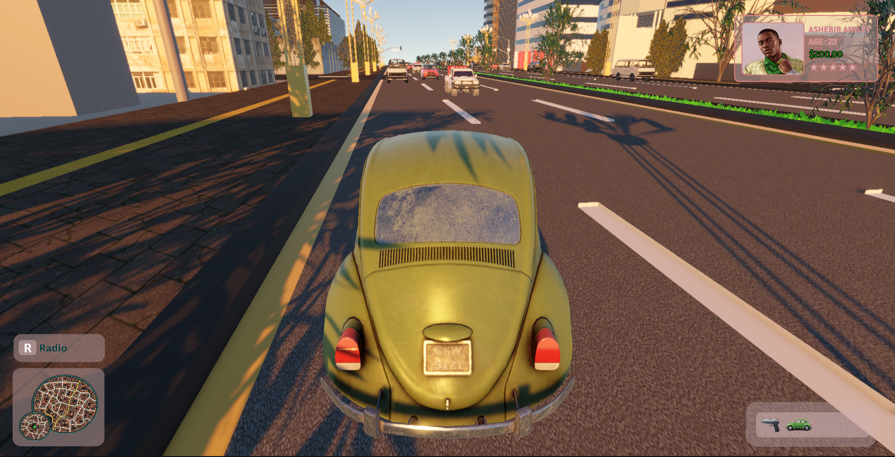

# ADDISSTRIP (Unity Prototype Game)

A 3D open-world prototype game built with :contentReference[oaicite:0]{index=0}.  
The game is set in a fictionalized version of Addis Ababa (Mexico area), inspired by real local architecture and urban environments.

This is an early-stage prototype focused on gameplay systems, environment building, and experimentation.

---

## 📸 Screenshots

---

## 🎮 Features

- Open-world 3D environment
- Player movement (walk, run, jump)
- Driveable vehicle system (Volkswagen Beetle)
- NPC characters with ambient dialogue
- NPC traffic system (cars + pedestrians, currently optimized/disabled in parts)
- Basic combat system (shooting mechanics)
- Interactive radio system with station switching in vehicles
- Custom-built city environment using Blender models + imported assets

---

## 🧱 Environment

The map is a small prototype section inspired by “Mexico” area in Addis Ababa.  
Buildings include:

- Custom Blender models (real-life inspired structures)
- Imported 3D assets (temporary placeholders)
- Street props like lamp posts and city elements

---

## ⚠️ Status

This is a **prototype / work-in-progress** project.

Known issues:
- Optimization not finalized
- NPC systems partially disabled
- Physics and AI still unstable in some areas
- Asset cleanup required

---

## 🛠️ Built With

- :contentReference[oaicite:1]{index=1}
- Blender (3D Modeling)
- C# (Game Logic)

---

## 📌 Notes

This project is for learning and portfolio purposes only.  
Not a final or commercial release.
This project is currently not available as a playable release while optimization and packaging are still in progress.

---

## 🚀 Future Improvements

- Performance optimization
- Improved NPC AI systems
- Better traffic system
- Map expansion
- Cleaner asset pipeline

